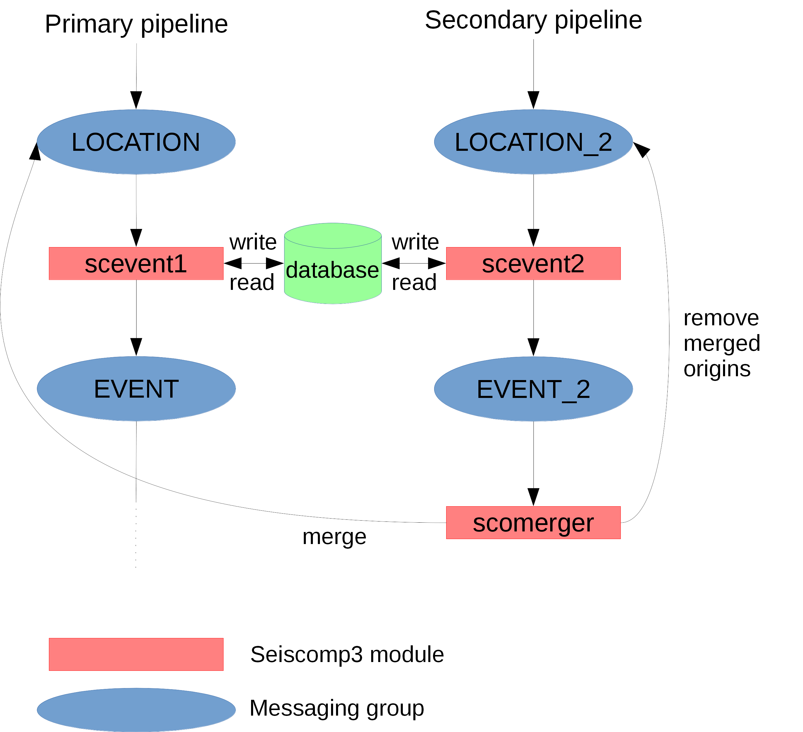

SCOMERGER
=========

`scomerger` is a seiscomp3 application which aims to merge origins belonging
to the same event and from 2 differents authors (*primary* and *secondary*). A
new origin is created with arrivals from both origins and then a relocation
(LocSAT) is done.

`scomerger` works like this:

- it listens to `EVENT` messages from `scevent2`from the *secondary* pipeline,
- when a `EVENT` message is received :

    - if the preferred origin is already a merged origin, `scomerger` send a
	  message to `scevent2` to remove this merged origin. `scevent2` selects then
	  a new preferred origin and sends a new `EVENT` message (which will be
	  received and processed by `scomerger`).
	- if the preferred origin is from the *primary* author, `scomerger` merges
	  the origin from the *primary* author with the *secondary* one. A new
	  origin is created with the arrivals of both origins and relocated with
	  `LOCSAT` (magnitude is not yet updated for the moment).
    - `scomerger` send a message to `scevent2` to create the new origin in the
	  database. An `originreference` is created as well to associate the origin
	  to the event. `scevent2` selects also a new preferred origin.

  > **Note**
  >
  > Merged origin has **scomerger** as AUTHOR (used to know if it's a merged 
  > origin).
  >
  > Merged origin `EvaluationMode` is set to `automatic`.
  >
  > Origins coming from *secondary* (author|pipeline) must be created after
  > *primary* ones.

  > Every modifications of the database must be done by `scevent2`. That's why
  > `scomerger` send messages to it.

`scomerger` was designed to work separately from the mainstream to avoid 
nested messages. `scomerger` indeed listen to `EVENT` messaging group on a 
dedicated *secondary* pipeline but also send messages to it.



Installation
------------

1. Copy the different files into seiscomp3 folders:

    ```bash
    cp descriptions/scomerger.xml /path/to/seiscomp3/etc/descriptions/
cp init/scomerger.py /path/to/seiscomp3/etc/init/
cp scomerger /path/to/seiscomp3/bin/
    ```

2. Configure `scomerger`

3. Activate the seiscomp3 module:

    ```bash
    seiscomp enable scomerger
seiscomp start scomerger
    ```

Useful options
--------------

`scomerger` can be run on a particular event with the `-E` or `--event` option:

```bash
seiscomp exec scomerger -E eost2016ehix
```

It can be run on a period of time as well:

```bash
seiscomp exec scomerger --begin 2016-03-01T00:00:00.0 --end 2016-03-08T00:00:00.0
```

It is also possible to remove the merged origins with the `-R` option:

```bash
seiscomp exec scomerger -E eost2016ehix -R
```
